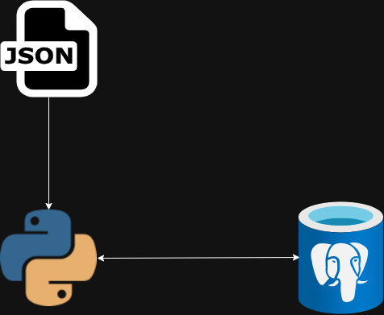

<div align="center">
  
</div>

<div align="center">
  <h1>Trabalho Prático - LOG</h1>
</div>

<div align="center">
  <h2>Implementação do mecanismo de log Undo com checkpoint usando o SGBD</h2>
</div>

<div align="center">
  <p>Conheça a incrível equipe por trás deste projeto</p>
</div>

<div align="center">
  <table>
    <tr>
      <td align="center">
        <a href="https://github.com/angemydelson">
          <br>
          <sub><b>Angemydelson Saint Bert</b></sub>
        </a>
      </td>
      <td align="center">
        <a href="https://github.com/Jacquet12">
          <br>
          <sub><b>Jacquet Leme</b></sub>
        </a>
      </td>
    </tr>
  </table>
</div>

---

<!-- <div align="center">
  <h2>Preview e Acesso da Aplicação</h2>
  
</div> -->


---

<div align="center">
  <h2>📑 Sumário</h2>
</div>

---

### 1. [Propósito](#ancora1)
   - 1.1 [Ferramentas Utilizadas](#ancora1-1)
   
### 2. [Evolução do Projeto](#ancora2)
   - 2.1 [Inicialização do Banco de Dados](#ancora2-1)
   - 2.2 [Carregamento do Arquivo de Log](#ancora2-2)
   - 2.3 [Identificação das Transações para UNDO](#ancora2-3)
   - 2.4 [Verificação e Atualização de Valores](#ancora2-4)
   - 2.5 [Relatório de Atualizações](#ancora2-5)
   - 2.6 [Execução do UNDO](#ancora2-6)

### 3. [Estrutura de Diretórios](#ancora3)

### 4. [Infraestrutura do projeto](#ancora4)

### 5. [Desafios Enfrentados](#ancora5)


---

<a id="ancora1"></a>
## 1. Propósito
- O objetivo geral deste trabalho é implementar um mecanismo de log Undo com checkpoint usando um Sistema de Gerenciamento de Banco de Dados (SGBD). O trabalho consiste em desenvolver um código capaz de ler um arquivo de log e um arquivo de metadados, validar as informações no banco de dados por meio do modelo UNDO
---

<a id="ancora1-1"></a>
### 1.1 Ferramentas Utilizadas

<div align="center">
    
    
    
</div>


---

<a id="ancora2"></a>
## 2. Evolução do Projeto

<a id="ancora2-1"></a>
#### 2.1 
  - Carregar o banco de dados com a tabela antes de executar o código do log, com o propósito de zerar as configurações e dados parciais. A tabela pode ter um número diferente de colunas e linhas.
#### 2.2 
  - Carregar o arquivo de log que contém informações sobre as transações realizadas no banco de dados.
#### 2.3 
  - Verificar quais transações devem realizar o UNDO e imprimir o nome das transações que irão sofrer UNDO.
#### 2.4 
  - Checar quais valores estão salvos nas tabelas por meio de operações de SELECT e atualizar os valores inconsistentes por meio de operações de UPDATE.
#### 2.5 
  - Reportar quais dados foram atualizados no banco de dados.
#### 2.6
  - Seguir o fluxo de execução conforme o método de UNDO, conforme discutido em aulas anteriores, garantindo que as transações sejam revertidas para seus estados anteriores.


<a id="ancora3"></a>
## 3. Estrutura de Diretórios
* ```scripts```
    * ```__init__.py```
    * ```db_config.py```
    * ```load_database.py```
    * ```log_undo.py```
    * ```print_out.py```
* ```Assets```
    * ```postgresSQL.png```
    * ```SGBD.png```
* ```test_files```
    * ```entradaLog.txt```
    * ```metadado.json```
* ```.gitignore```
* ```README.md```
* ```database.ini```
* ```main.py```
* ```LICENSE```

***

---

<a id="ancora4"></a>
## 4. Infraestrutura do projeto

<div align="center">
  
</div>

---

<a id="ancora5"></a>
## 5. Desafios Enfrentados

<!-- Desafios enfrentados durante o desenvolvimento -->
- Desafios enfrentados: Tivemos algumas dificuldades ao implementar a função undo_changes, pois estava apresentando erros.

---
